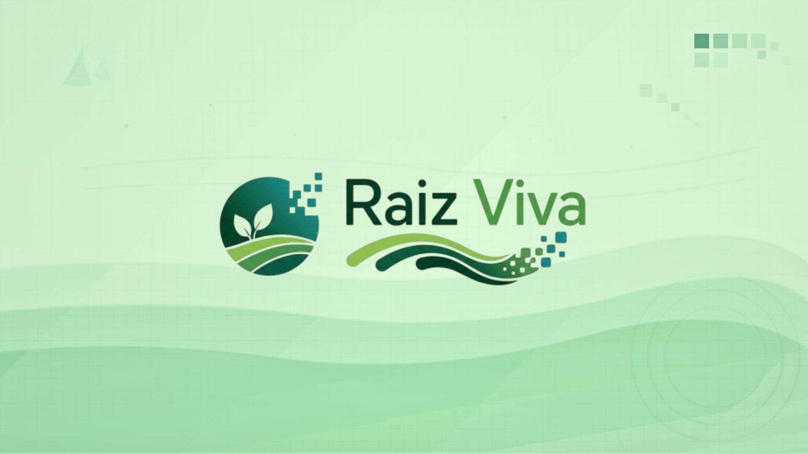
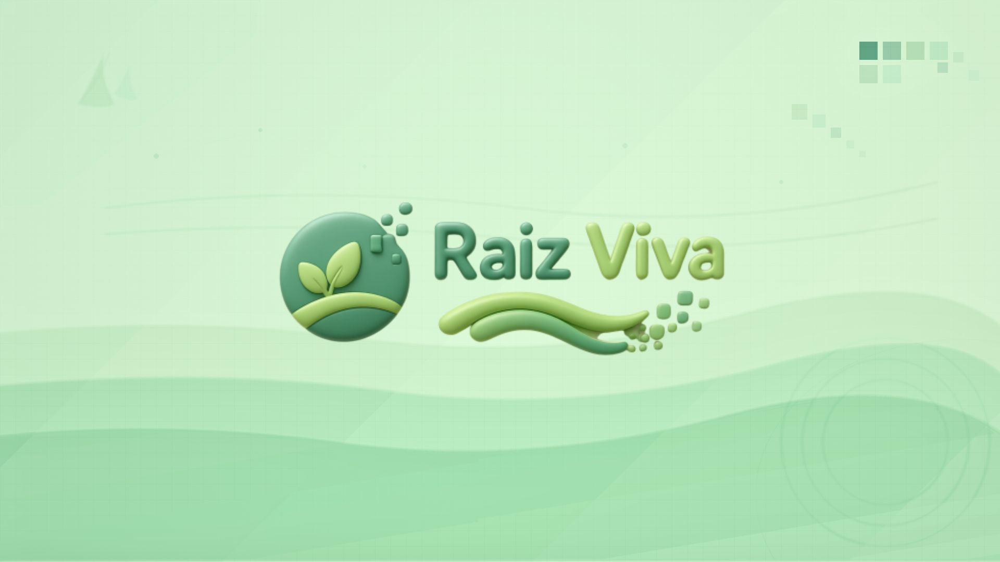
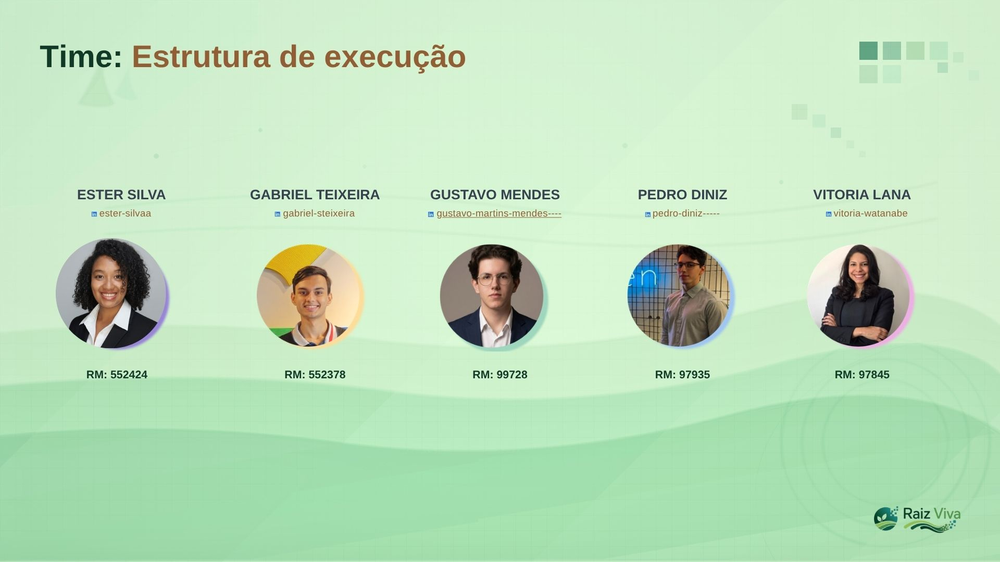
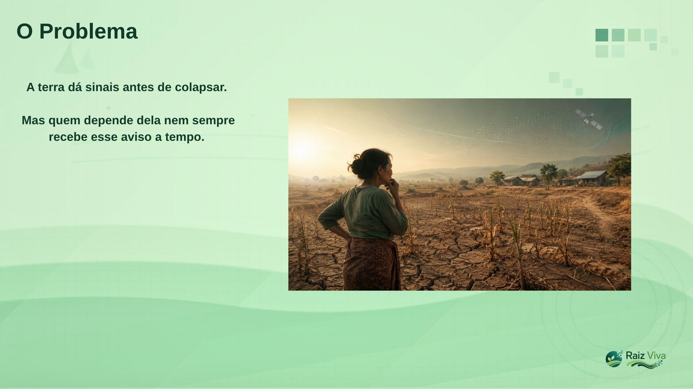
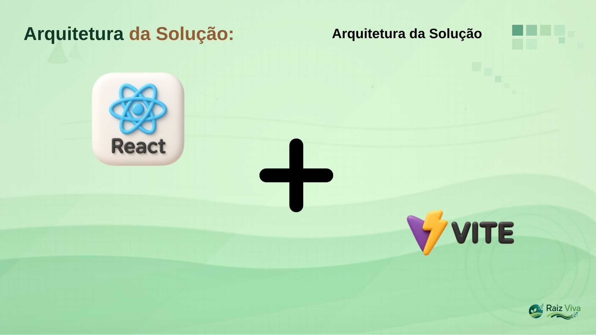
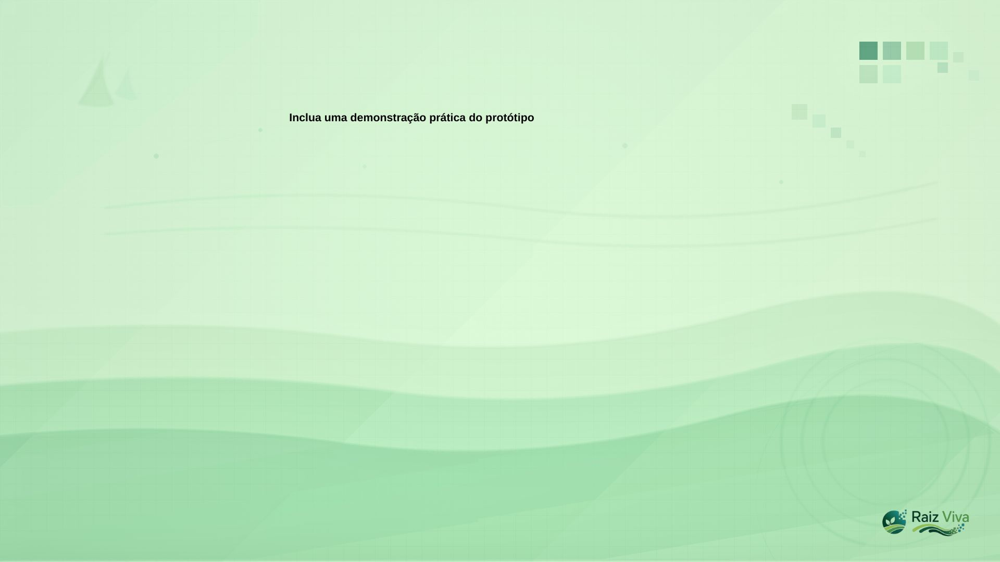
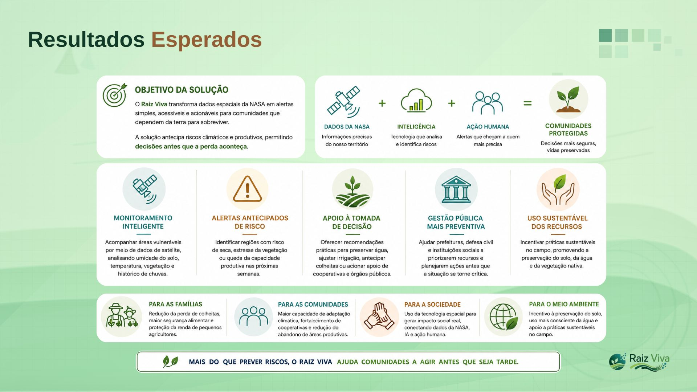
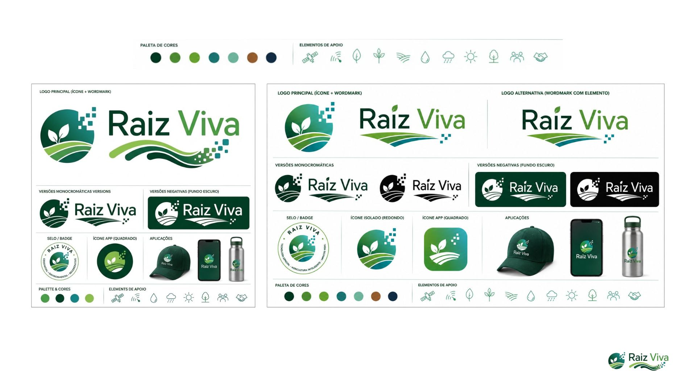

O grupo deverá pensar, refletir, planejar e implementar uma solução prática que realmente contribua para resolver ou minimizar um problema encontrado no ecossistema espacial. Não basta apenas apresentar ideias abstratas: é necessário colocar a mão na massa e desenvolver um protótipo funcional. Deve ser uma solução com propósito, uma aplicação real, com justificativa forte e clara.

Entregáveis:

Disponibilizar o código-fonte da parte (2) em repositório GitHub, público ou privado, compartilhado com o tutor. O repositório deverá conter um README.md com descrição do projeto, tecnologias utilizadas e instruções básicas de execução.
Fazer um vídeo de até 4 minutos, que deve conter:
Identificação do Problema: Apresente claramente o problema real que o projeto está resolvendo. Mostre que o grupo entendeu o desafio.
Solução Proposta: Explique como a sua solução digital aborda o problema.
Mostre quais tecnologias, plataformas e recursos foram utilizados;
Detalhe como a solução foi implementada: frameworks, linguagens, APIs, componentes em nuvem, ferramentas de visualização de dados etc;
Inclua uma demonstração prática do protótipo: uma tela funcionando, uma ação interativa, um trecho do código rodando etc.
Resultados Esperados e Impacto:
Apresente de forma clara quais são os objetivos da solução.
Destaque o impacto positivo esperado: como a solução pode beneficiar usuários ou a sociedade?
Use a criatividade, pense fora da caixa, mas seja coerente e realista com o que está sendo proposto e implementado.
Este vídeo também deverá ser publicado no YoutTube, de forma pública ou não listada, e o seu link de acesso deverá ser entregue em um arquivo .txt.

Slides atualmente:

